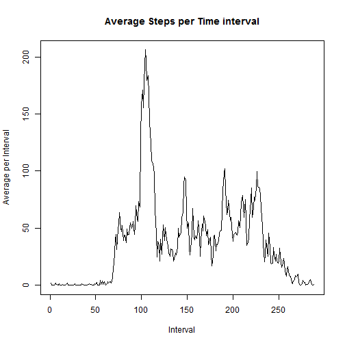
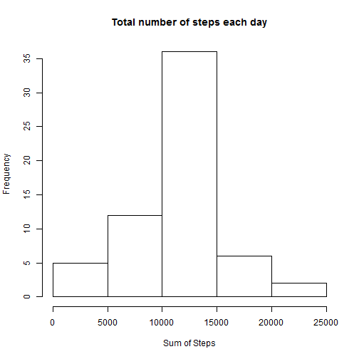

## Loading and preprocessing the data


```r
#Checking to see if Zipped file exists
if(file.exists("activity.zip")){
        unzip("activity.zip", overwrite=TRUE)
}

#reading data
activitydata<-read.csv("activity.csv",header=TRUE)
```


## What is mean total number of steps taken per day?

### Used aggregate function to get the mean/median of the steps/day based on date
### Aggregate function ignores the NA values by default


```r
stepsPerDay<-aggregate(steps ~ date, data=activitydata,sum)

#Trying to plot
hist(stepsPerDay$steps,xlab="Sum of Steps", main="Total number of steps each day")
```

 

```r
#mean of steps/day
print(aggregate(steps ~ date, data=activitydata,mean))
```

```
##          date      steps
## 1  2012-10-02  0.4375000
## 2  2012-10-03 39.4166667
## 3  2012-10-04 42.0694444
## 4  2012-10-05 46.1597222
## 5  2012-10-06 53.5416667
## 6  2012-10-07 38.2465278
## 7  2012-10-09 44.4826389
## 8  2012-10-10 34.3750000
## 9  2012-10-11 35.7777778
## 10 2012-10-12 60.3541667
## 11 2012-10-13 43.1458333
## 12 2012-10-14 52.4236111
## 13 2012-10-15 35.2048611
## 14 2012-10-16 52.3750000
## 15 2012-10-17 46.7083333
## 16 2012-10-18 34.9166667
## 17 2012-10-19 41.0729167
## 18 2012-10-20 36.0937500
## 19 2012-10-21 30.6284722
## 20 2012-10-22 46.7361111
## 21 2012-10-23 30.9652778
## 22 2012-10-24 29.0104167
## 23 2012-10-25  8.6527778
## 24 2012-10-26 23.5347222
## 25 2012-10-27 35.1354167
## 26 2012-10-28 39.7847222
## 27 2012-10-29 17.4236111
## 28 2012-10-30 34.0937500
## 29 2012-10-31 53.5208333
## 30 2012-11-02 36.8055556
## 31 2012-11-03 36.7048611
## 32 2012-11-05 36.2465278
## 33 2012-11-06 28.9375000
## 34 2012-11-07 44.7326389
## 35 2012-11-08 11.1770833
## 36 2012-11-11 43.7777778
## 37 2012-11-12 37.3784722
## 38 2012-11-13 25.4722222
## 39 2012-11-15  0.1423611
## 40 2012-11-16 18.8923611
## 41 2012-11-17 49.7881944
## 42 2012-11-18 52.4652778
## 43 2012-11-19 30.6979167
## 44 2012-11-20 15.5277778
## 45 2012-11-21 44.3993056
## 46 2012-11-22 70.9270833
## 47 2012-11-23 73.5902778
## 48 2012-11-24 50.2708333
## 49 2012-11-25 41.0902778
## 50 2012-11-26 38.7569444
## 51 2012-11-27 47.3819444
## 52 2012-11-28 35.3576389
## 53 2012-11-29 24.4687500
```

```r
#median of steps/day
print(median(stepsPerDay$steps))
```

```
## [1] 10765
```

## What is the average daily activity pattern?


```r
#mean of steps per time interval
#print(aggregate(steps ~ interval, data=activitydata,mean))
stepsInterval<-aggregate(steps ~ interval, data=activitydata,mean)


#Getting the time series
timeSeries <- ts(stepsInterval$steps)

plot(timeSeries, type="l", xlab="Interval", ylab="Average",main="Average Steps per Time interval")
```

 

```r
highestInterval<-stepsInterval[which(stepsInterval$steps==max(stepsInterval$steps)),]
print(highestInterval$interval)
```

```
## [1] 835
```

## Imputing missing values

### 1. Missing values


```r
#records with missing steps
ok<-complete.cases(activitydata)

#records with NA values
print(sum(!ok))
```

```
## [1] 2304
```

### 2. Stategy for filling in missing values


```r
#print(aggregate(steps ~ interval, data=activitydata,mean))
stepsInterval<-aggregate(steps ~ interval, data=activitydata,mean)

roundedStepsIntervalData<-data.frame(stepsInterval$interval,round(stepsInterval$steps))
names(roundedStepsIntervalData)<-c("interval", "averageSteps")
print(roundedStepsIntervalData)
```

```
##     interval averageSteps
## 1          0            2
## 2          5            0
## 3         10            0
## 4         15            0
## 5         20            0
## 6         25            2
## 7         30            1
## 8         35            1
## 9         40            0
## 10        45            1
## 11        50            0
## 12        55            0
## 13       100            0
## 14       105            1
## 15       110            0
## 16       115            0
## 17       120            0
## 18       125            1
## 19       130            2
## 20       135            0
## 21       140            0
## 22       145            0
## 23       150            0
## 24       155            0
## 25       200            0
## 26       205            0
## 27       210            1
## 28       215            0
## 29       220            0
## 30       225            0
## 31       230            0
## 32       235            0
## 33       240            0
## 34       245            0
## 35       250            2
## 36       255            1
## 37       300            0
## 38       305            0
## 39       310            0
## 40       315            0
## 41       320            0
## 42       325            1
## 43       330            2
## 44       335            1
## 45       340            0
## 46       345            0
## 47       350            0
## 48       355            0
## 49       400            1
## 50       405            1
## 51       410            3
## 52       415            0
## 53       420            0
## 54       425            0
## 55       430            4
## 56       435            1
## 57       440            3
## 58       445            1
## 59       450            3
## 60       455            1
## 61       500            0
## 62       505            2
## 63       510            3
## 64       515            2
## 65       520            3
## 66       525            3
## 67       530            2
## 68       535            6
## 69       540           16
## 70       545           18
## 71       550           39
## 72       555           44
## 73       600           31
## 74       605           49
## 75       610           54
## 76       615           63
## 77       620           50
## 78       625           47
## 79       630           52
## 80       635           39
## 81       640           44
## 82       645           44
## 83       650           37
## 84       655           49
## 85       700           44
## 86       705           44
## 87       710           51
## 88       715           55
## 89       720           50
## 90       725           51
## 91       730           56
## 92       735           44
## 93       740           52
## 94       745           70
## 95       750           58
## 96       755           56
## 97       800           73
## 98       805           68
## 99       810          129
## 100      815          158
## 101      820          171
## 102      825          155
## 103      830          177
## 104      835          206
## 105      840          196
## 106      845          180
## 107      850          183
## 108      855          167
## 109      900          143
## 110      905          124
## 111      910          109
## 112      915          108
## 113      920          104
## 114      925           96
## 115      930           66
## 116      935           45
## 117      940           25
## 118      945           39
## 119      950           35
## 120      955           21
## 121     1000           41
## 122     1005           27
## 123     1010           42
## 124     1015           53
## 125     1020           39
## 126     1025           51
## 127     1030           44
## 128     1035           37
## 129     1040           35
## 130     1045           28
## 131     1050           25
## 132     1055           32
## 133     1100           31
## 134     1105           30
## 135     1110           21
## 136     1115           26
## 137     1120           28
## 138     1125           26
## 139     1130           33
## 140     1135           50
## 141     1140           42
## 142     1145           45
## 143     1150           46
## 144     1155           59
## 145     1200           64
## 146     1205           88
## 147     1210           95
## 148     1215           93
## 149     1220           63
## 150     1225           50
## 151     1230           54
## 152     1235           32
## 153     1240           27
## 154     1245           38
## 155     1250           45
## 156     1255           67
## 157     1300           42
## 158     1305           40
## 159     1310           43
## 160     1315           41
## 161     1320           46
## 162     1325           56
## 163     1330           43
## 164     1335           25
## 165     1340           40
## 166     1345           54
## 167     1350           47
## 168     1355           61
## 169     1400           56
## 170     1405           52
## 171     1410           44
## 172     1415           49
## 173     1420           35
## 174     1425           38
## 175     1430           42
## 176     1435           28
## 177     1440           17
## 178     1445           26
## 179     1450           44
## 180     1455           44
## 181     1500           30
## 182     1505           36
## 183     1510           35
## 184     1515           39
## 185     1520           46
## 186     1525           48
## 187     1530           48
## 188     1535           65
## 189     1540           83
## 190     1545           99
## 191     1550          102
## 192     1555           84
## 193     1600           62
## 194     1605           64
## 195     1610           75
## 196     1615           63
## 197     1620           57
## 198     1625           60
## 199     1630           44
## 200     1635           39
## 201     1640           45
## 202     1645           45
## 203     1650           46
## 204     1655           44
## 205     1700           47
## 206     1705           56
## 207     1710           51
## 208     1715           61
## 209     1720           73
## 210     1725           79
## 211     1730           69
## 212     1735           60
## 213     1740           75
## 214     1745           57
## 215     1750           35
## 216     1755           37
## 217     1800           41
## 218     1805           58
## 219     1810           75
## 220     1815           85
## 221     1820           59
## 222     1825           68
## 223     1830           78
## 224     1835           74
## 225     1840           85
## 226     1845           99
## 227     1850           87
## 228     1855           86
## 229     1900           85
## 230     1905           78
## 231     1910           58
## 232     1915           53
## 233     1920           36
## 234     1925           21
## 235     1930           27
## 236     1935           40
## 237     1940           30
## 238     1945           26
## 239     1950           46
## 240     1955           34
## 241     2000           20
## 242     2005           19
## 243     2010           19
## 244     2015           33
## 245     2020           27
## 246     2025           21
## 247     2030           27
## 248     2035           21
## 249     2040           20
## 250     2045           21
## 251     2050           32
## 252     2055           20
## 253     2100           16
## 254     2105           17
## 255     2110           23
## 256     2115           19
## 257     2120           12
## 258     2125            8
## 259     2130           15
## 260     2135           16
## 261     2140            9
## 262     2145            8
## 263     2150            8
## 264     2155            3
## 265     2200            1
## 266     2205            4
## 267     2210            5
## 268     2215            9
## 269     2220            7
## 270     2225            9
## 271     2230           10
## 272     2235            2
## 273     2240            0
## 274     2245            0
## 275     2250            2
## 276     2255            5
## 277     2300            3
## 278     2305            3
## 279     2310            0
## 280     2315            1
## 281     2320            1
## 282     2325            2
## 283     2330            3
## 284     2335            5
## 285     2340            3
## 286     2345            1
## 287     2350            0
## 288     2355            1
```

```r
addedActivitydata<-join(activitydata,roundedStepsIntervalData, by="interval")
```

### 3. Creating a new dataset that is equal to the original dataset but with the missing data filled in


```r
for(i in 1:nrow(addedActivitydata)){
        temp<-addedActivitydata[i,]
        
        if(is.na(temp$steps)){
                temp$steps<-temp$averageSteps
        }
        addedActivitydata[i,]<-temp
}
imputedActivityData<-addedActivitydata[,1:3]

#print(imputedActivityData)
```

### 4. Histogram, mean and median with imputed activity data set


```r
stepsPerDay<-aggregate(steps ~ date, data=imputedActivityData,sum)

#Trying to plot
hist(stepsPerDay$steps,xlab="Sum of Steps", main="Total number of steps each day")
```

 

```r
#mean of steps/day
print(aggregate(steps ~ date, data=imputedActivityData,mean))
```

```
##          date      steps
## 1  2012-10-01 37.3680556
## 2  2012-10-02  0.4375000
## 3  2012-10-03 39.4166667
## 4  2012-10-04 42.0694444
## 5  2012-10-05 46.1597222
## 6  2012-10-06 53.5416667
## 7  2012-10-07 38.2465278
## 8  2012-10-08 37.3680556
## 9  2012-10-09 44.4826389
## 10 2012-10-10 34.3750000
## 11 2012-10-11 35.7777778
## 12 2012-10-12 60.3541667
## 13 2012-10-13 43.1458333
## 14 2012-10-14 52.4236111
## 15 2012-10-15 35.2048611
## 16 2012-10-16 52.3750000
## 17 2012-10-17 46.7083333
## 18 2012-10-18 34.9166667
## 19 2012-10-19 41.0729167
## 20 2012-10-20 36.0937500
## 21 2012-10-21 30.6284722
## 22 2012-10-22 46.7361111
## 23 2012-10-23 30.9652778
## 24 2012-10-24 29.0104167
## 25 2012-10-25  8.6527778
## 26 2012-10-26 23.5347222
## 27 2012-10-27 35.1354167
## 28 2012-10-28 39.7847222
## 29 2012-10-29 17.4236111
## 30 2012-10-30 34.0937500
## 31 2012-10-31 53.5208333
## 32 2012-11-01 37.3680556
## 33 2012-11-02 36.8055556
## 34 2012-11-03 36.7048611
## 35 2012-11-04 37.3680556
## 36 2012-11-05 36.2465278
## 37 2012-11-06 28.9375000
## 38 2012-11-07 44.7326389
## 39 2012-11-08 11.1770833
## 40 2012-11-09 37.3680556
## 41 2012-11-10 37.3680556
## 42 2012-11-11 43.7777778
## 43 2012-11-12 37.3784722
## 44 2012-11-13 25.4722222
## 45 2012-11-14 37.3680556
## 46 2012-11-15  0.1423611
## 47 2012-11-16 18.8923611
## 48 2012-11-17 49.7881944
## 49 2012-11-18 52.4652778
## 50 2012-11-19 30.6979167
## 51 2012-11-20 15.5277778
## 52 2012-11-21 44.3993056
## 53 2012-11-22 70.9270833
## 54 2012-11-23 73.5902778
## 55 2012-11-24 50.2708333
## 56 2012-11-25 41.0902778
## 57 2012-11-26 38.7569444
## 58 2012-11-27 47.3819444
## 59 2012-11-28 35.3576389
## 60 2012-11-29 24.4687500
## 61 2012-11-30 37.3680556
```

```r
#median of steps/day
print(median(stepsPerDay$steps))
```

```
## [1] 10762
```

## Are there differences in activity patterns between weekdays and weekends?
