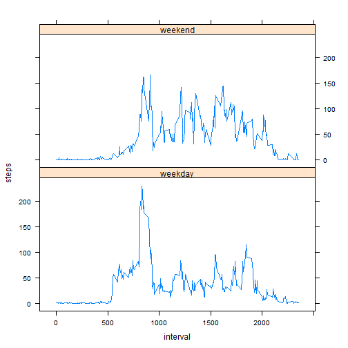

## Loading and preprocessing the data

Looking if the zipped file exists before unzipping and reading the data into a activitydata data frame.


```r
#Checking to see if Zipped file exists
if(file.exists("activity.zip")){
        unzip("activity.zip", overwrite=TRUE)
}

#reading data
activitydata<-read.csv("activity.csv",header=TRUE)
```


## What is mean total number of steps taken per day?

Used aggregate function to get the mean/median of the steps/day based on date
Aggregate function ignores the NA values by default


```r
stepsPerDay<-aggregate(steps ~ date, data=activitydata,sum)

#Trying to plot
hist(stepsPerDay$steps,xlab="Sum of Steps", main="Total number of steps each day")
```

 


Using the following logic to calcuate the mean. 

1. Total all time intervals for a day 
2. Calculate the mean for that day


Max mean was observed on this day (see below for means per day)

### Internal #  Date            Mean
### 47          2012-11-23      73.5902778


```r
#mean of steps/day
print(aggregate(steps ~ date, data=activitydata,mean))
```

```
##          date      steps
## 1  2012-10-02  0.4375000
## 2  2012-10-03 39.4166667
## 3  2012-10-04 42.0694444
## 4  2012-10-05 46.1597222
## 5  2012-10-06 53.5416667
## 6  2012-10-07 38.2465278
## 7  2012-10-09 44.4826389
## 8  2012-10-10 34.3750000
## 9  2012-10-11 35.7777778
## 10 2012-10-12 60.3541667
## 11 2012-10-13 43.1458333
## 12 2012-10-14 52.4236111
## 13 2012-10-15 35.2048611
## 14 2012-10-16 52.3750000
## 15 2012-10-17 46.7083333
## 16 2012-10-18 34.9166667
## 17 2012-10-19 41.0729167
## 18 2012-10-20 36.0937500
## 19 2012-10-21 30.6284722
## 20 2012-10-22 46.7361111
## 21 2012-10-23 30.9652778
## 22 2012-10-24 29.0104167
## 23 2012-10-25  8.6527778
## 24 2012-10-26 23.5347222
## 25 2012-10-27 35.1354167
## 26 2012-10-28 39.7847222
## 27 2012-10-29 17.4236111
## 28 2012-10-30 34.0937500
## 29 2012-10-31 53.5208333
## 30 2012-11-02 36.8055556
## 31 2012-11-03 36.7048611
## 32 2012-11-05 36.2465278
## 33 2012-11-06 28.9375000
## 34 2012-11-07 44.7326389
## 35 2012-11-08 11.1770833
## 36 2012-11-11 43.7777778
## 37 2012-11-12 37.3784722
## 38 2012-11-13 25.4722222
## 39 2012-11-15  0.1423611
## 40 2012-11-16 18.8923611
## 41 2012-11-17 49.7881944
## 42 2012-11-18 52.4652778
## 43 2012-11-19 30.6979167
## 44 2012-11-20 15.5277778
## 45 2012-11-21 44.3993056
## 46 2012-11-22 70.9270833
## 47 2012-11-23 73.5902778
## 48 2012-11-24 50.2708333
## 49 2012-11-25 41.0902778
## 50 2012-11-26 38.7569444
## 51 2012-11-27 47.3819444
## 52 2012-11-28 35.3576389
## 53 2012-11-29 24.4687500
```


Using the following logic for median

1. Totalling all steps for the day
2. Calculating the median across the total steps for all days

Median was observed to be the following
### 10765


```r
#median of steps/day
print(median(stepsPerDay$steps))
```

```
## [1] 10765
```

## What is the average daily activity pattern?

Using a time series plotting the average steps per time interval


```r
#mean of steps per time interval
#print(aggregate(steps ~ interval, data=activitydata,mean))
stepsInterval<-aggregate(steps ~ interval, data=activitydata,mean)


#Getting the time series
timeSeries <- ts(stepsInterval$steps)

plot(timeSeries, type="l", xlab="Interval", ylab="Average",main="Average Steps per Time interval")
```

 

```r
highestInterval<-stepsInterval[which(stepsInterval$steps==max(stepsInterval$steps)),]
print(highestInterval$interval)
```

```
## [1] 835
```

## Imputing missing values

### 1. Missing values

Using complete.cases() method and negating the records for getting a count of missing values


```r
#records with missing steps
ok<-complete.cases(activitydata)

#records with NA values
print(sum(!ok))
```

```
## [1] 2304
```

### 2. Stategy for filling in missing values

The strategy is as follows.

1. Get a mean value for each time interval
2. Round the mean values
3. Adding an additional column with the rounded values to the orginal activity data frame. This is done by joining on the time interval for each day. The idea is that when values as missing we can use the rounded mean values for the time interval.
4. Prepping the data frame for later use.


```r
#Getting the mean for each interval
stepsInterval<-aggregate(steps ~ interval, data=activitydata,mean)

#rounding the mean values
roundedStepsIntervalData<-data.frame(stepsInterval$interval,round(stepsInterval$steps))
names(roundedStepsIntervalData)<-c("interval", "averageSteps")

#adding the rounded steps for each time interval as a column for later processing
addedActivitydata<-join(activitydata,roundedStepsIntervalData, by="interval")
```

### 3. Creating a new dataset that is equal to the original dataset but with the missing data filled in

In this step we will use the newly added rounded column value instead of the NA value of the record. This will give us the imputed data set.


```r
#looping through the data to replace values for NA values from the newly added rounded mean column
for(i in 1:nrow(addedActivitydata)){
        temp<-addedActivitydata[i,]
        
        if(is.na(temp$steps)){
                temp$steps<-temp$averageSteps
        }
        addedActivitydata[i,]<-temp
}

#tidying the data frame
imputedActivityData<-addedActivitydata[,1:3]
```

### 4. Histogram, mean and median with imputed activity data set

This is simply plotting the same way as earlier using the imputed activity data set.

Complete set of values were visible for all days due to the imputing activity (not missing values)

Values don't seem to really change (only minor changes). There was no change for the max mean observed.

Max mean was observed to be the following day (same as first observation and also the same value)

###    Internal #  Date            Mean
### 54             2012-11-23      73.5902778


Median only slightly changed
### 10762


```r
#Sum of steps per day
stepsPerDay<-aggregate(steps ~ date, data=imputedActivityData,sum)

#Trying to plot
hist(stepsPerDay$steps,xlab="Sum of Steps", main="Total number of steps each day")
```

 

```r
#mean of steps/day
print(aggregate(steps ~ date, data=imputedActivityData,mean))
```

```
##          date      steps
## 1  2012-10-01 37.3680556
## 2  2012-10-02  0.4375000
## 3  2012-10-03 39.4166667
## 4  2012-10-04 42.0694444
## 5  2012-10-05 46.1597222
## 6  2012-10-06 53.5416667
## 7  2012-10-07 38.2465278
## 8  2012-10-08 37.3680556
## 9  2012-10-09 44.4826389
## 10 2012-10-10 34.3750000
## 11 2012-10-11 35.7777778
## 12 2012-10-12 60.3541667
## 13 2012-10-13 43.1458333
## 14 2012-10-14 52.4236111
## 15 2012-10-15 35.2048611
## 16 2012-10-16 52.3750000
## 17 2012-10-17 46.7083333
## 18 2012-10-18 34.9166667
## 19 2012-10-19 41.0729167
## 20 2012-10-20 36.0937500
## 21 2012-10-21 30.6284722
## 22 2012-10-22 46.7361111
## 23 2012-10-23 30.9652778
## 24 2012-10-24 29.0104167
## 25 2012-10-25  8.6527778
## 26 2012-10-26 23.5347222
## 27 2012-10-27 35.1354167
## 28 2012-10-28 39.7847222
## 29 2012-10-29 17.4236111
## 30 2012-10-30 34.0937500
## 31 2012-10-31 53.5208333
## 32 2012-11-01 37.3680556
## 33 2012-11-02 36.8055556
## 34 2012-11-03 36.7048611
## 35 2012-11-04 37.3680556
## 36 2012-11-05 36.2465278
## 37 2012-11-06 28.9375000
## 38 2012-11-07 44.7326389
## 39 2012-11-08 11.1770833
## 40 2012-11-09 37.3680556
## 41 2012-11-10 37.3680556
## 42 2012-11-11 43.7777778
## 43 2012-11-12 37.3784722
## 44 2012-11-13 25.4722222
## 45 2012-11-14 37.3680556
## 46 2012-11-15  0.1423611
## 47 2012-11-16 18.8923611
## 48 2012-11-17 49.7881944
## 49 2012-11-18 52.4652778
## 50 2012-11-19 30.6979167
## 51 2012-11-20 15.5277778
## 52 2012-11-21 44.3993056
## 53 2012-11-22 70.9270833
## 54 2012-11-23 73.5902778
## 55 2012-11-24 50.2708333
## 56 2012-11-25 41.0902778
## 57 2012-11-26 38.7569444
## 58 2012-11-27 47.3819444
## 59 2012-11-28 35.3576389
## 60 2012-11-29 24.4687500
## 61 2012-11-30 37.3680556
```

```r
#median of steps/day
print(median(stepsPerDay$steps))
```

```
## [1] 10762
```

## Are there differences in activity patterns between weekdays and weekends?

For obvious reasons the weekends are more active with more spikes in time intervals directly observed from the plot when compared to weekdays.

People tend to have more time over the weekends to work out.


```r
#Using weekdays to create a days factor
imputedActivityData$days<-weekdays(as.Date(imputedActivityData$date))


#splitting on days to figure out later which are weekdays and which are weekends
imputedActivityDataDays<-split(imputedActivityData, imputedActivityData$days)

#Calculating the weekdays
Monday<-data.frame(imputedActivityDataDays$Monday)
Tuesday<-data.frame(imputedActivityDataDays$Tuesday)
Wednesday<-data.frame(imputedActivityDataDays$Wednesday)
Thursday<-data.frame(imputedActivityDataDays$Thursday)
Friday<-data.frame(imputedActivityDataDays$Friday)

#using rbind to combine into one weekday data frame
weekday<-rbind(Monday,Tuesday,Wednesday,Thursday,Friday)

#calculating the mean
weekdaystepsInterval<-aggregate(steps ~ interval, data=weekday,mean)
weekdaystepsInterval$days<-"weekday"
        

#Calculating the weekends
Saturday<-data.frame(imputedActivityDataDays$Saturday)
Sunday<-data.frame(imputedActivityDataDays$Sunday)

#using rbind to combine into one weekday data frame
weekend<-rbind(Saturday,Sunday)

#calculating the mean
weekendstepsInterval<-aggregate(steps ~ interval, data=weekend,mean)
weekendstepsInterval$days<-"weekend"

#Combining weekday and weekend rows into all rows
allrows<-rbind(weekdaystepsInterval,weekendstepsInterval)

#plotting using xyplot
library(lattice)
xyplot(steps ~ interval|days,data=allrows, layout=c(1,2), type="l")
```

 
